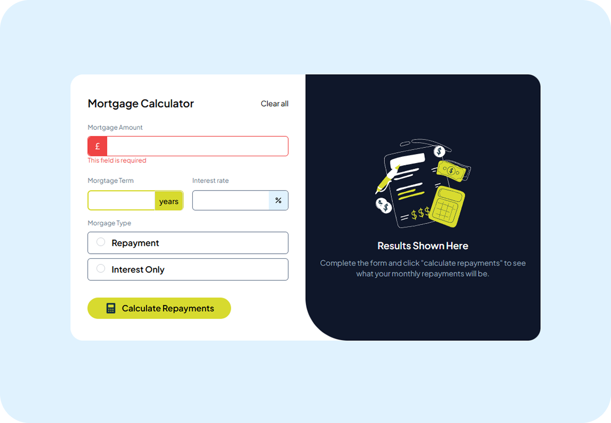
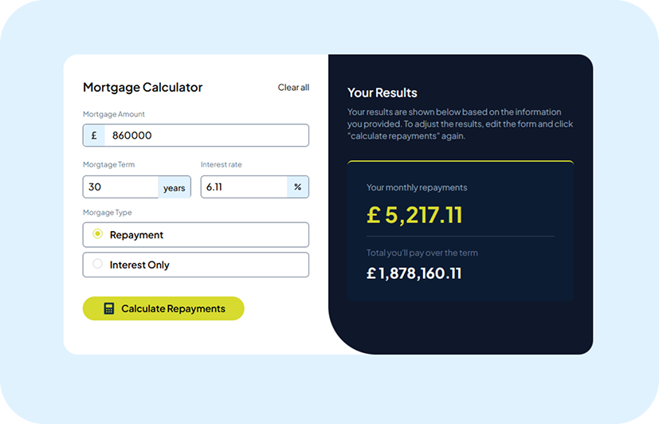
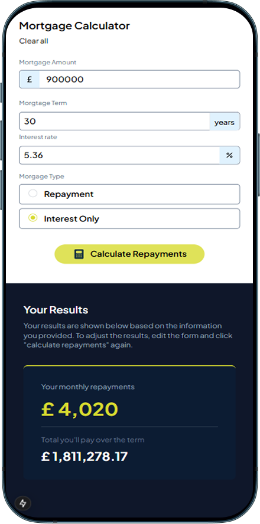

# Frontend Mentor - Mortgage repayment calculator solution

This is a solution to the [Mortgage repayment calculator challenge on Frontend Mentor](https://www.frontendmentor.io/challenges/mortgage-repayment-calculator-Galx1LXK73). Frontend Mentor challenges help you improve your coding skills by building realistic projects. 

## Table of contents

- [Overview](#overview)
  - [The challenge](#the-challenge)
  - [Screenshot](#screenshot)
  - [Links](#links)
- [My process](#my-process)
  - [Built with](#built-with)
  - [What I learned](#what-i-learned)
  - [Continued development](#continued-development)
  - [Useful resources](#useful-resources)
- [Author](#author)
- [Acknowledgments](#acknowledgments)

## Overview

### The challenge

Users should be able to:

- Input mortgage information and see monthly repayment and total repayment amounts after submitting the form
- See form validation messages if any field is incomplete
- Complete the form only using their keyboard
- View the optimal layout for the interface depending on their device's screen size
- See hover and focus states for all interactive elements on the page

### Screenshot

 
 

### Links

- Solution URL: [Add solution URL here](https://github.com/ja-15/mortgage-repayment-calculator)
- Live Site URL: [Add live site URL here](https://mortgage-repayment-calculator-black.vercel.app/)

## My process

### Built with

- Nextjs
- TailwindCSS
- Typescript
- Mobile-first workflow
- [React](https://reactjs.org/) - JS library
- [Next.js](https://nextjs.org/) - React framework

### What I learned

I learned about working with complex form design and handling advanced validation, dynamic field rendering, and user-friendly error messages.

### Continued development

I will be focusing on learning more and mastering nextjs and typescript

### Useful resources

- [Example resource 1](https://tailwindcss.com/docs/installation/framework-guides/nextjs) - I stick with learning and reading tailwindcss docs for the styling
- (https://nextjs.org/docs) - This helps me read a lot about nextjs

## Author

- Website - [John Arenga](my-portfolio-website-black-nine.vercel.app)
- Frontend Mentor - [@ja-15](https://www.frontendmentor.io/profile/ja-15)
- Twitter - [@john_151992](https://x.com/john_151992)

## Acknowledgments

I would like to thank you [frontendmentor.io](https://www.frontendmentor.io) team for creating a valuable content that help me enhance my skills as a developer

